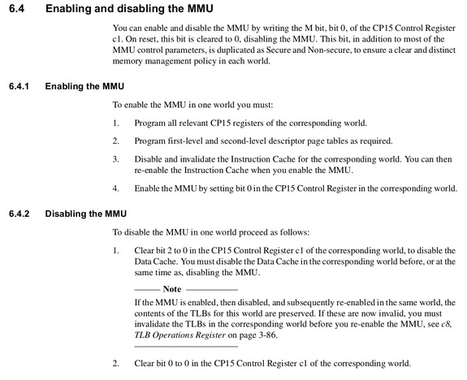
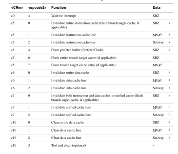
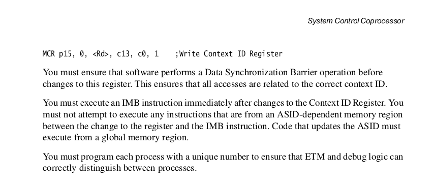
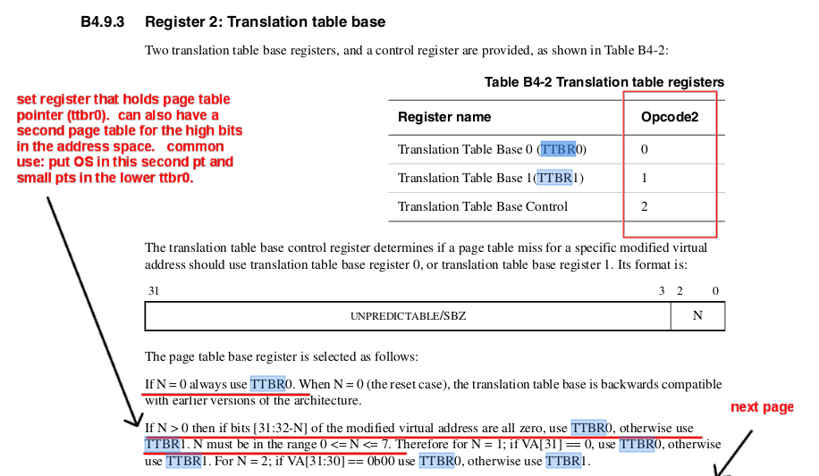

## Hooking translation up to hardware

<p align="center">
  
</p>

-----------------------------------------------------------------------
***Bugs***:

  - Part 5: talked about `ttbd` --- it's `ttbc` (we've updated the readme below).

  - Part 1: Multiple definitions: When you implement
    `cp15_ctrl_reg1_rd` you'll get a multiple definition error.  Just do
    a pull and this will get fixed.

    If you pulled and got a undefined error, just drop in:

            cp15_ctrl_reg1_t cp15_ctrl_reg1_rd(void) {
                return staff_cp15_ctrl_reg1_rd();
            }

  - Part 1: The comment for `cp15_domain_ctrl_wr` says you need to
    "flush_btb, dsb, prefetch flush" but I think you only need the
    prefetch flush.  You'll also need to make a `cp15_domain_ctrl_rd`.

  - Part 6: when you remove all the staff code, you will have to modify
    your pinned-vm.h to remove the staff calls:

```
        // pinned-vm.h: delete the staff_* prefixes
        
        // simple wrappers
        static inline void pin_mmu_enable(void) {
            assert(!mmu_is_enabled());
            staff_mmu_enable();
            assert(mmu_is_enabled());
        }
        static inline void pin_mmu_disable(void) {
            assert(mmu_is_enabled());
            staff_mmu_disable();
            assert(!mmu_is_enabled());
        }
```


***Clarifications***:

  - You can use the macros in `arm6-coprocessor-asm.h` in the assembly
    code.  E.g.,


```
        mov r2, #2  @ clear r2
        INV_DCACHE(r2)
        INV_ICACHE(r2)
        INV_TLB(r2)
```


  - If your `pinned-vm.c` has issues: we've checked in
    `code/orig-pinned-vm.c` you can just change the `Makefile` to use
    this instead.

        # change the code/Makefile to use orig-pinnned-vm.c
        # COMMON_SRC += pinned-vm.c
        COMMON_SRC += orig-pinned-vm.c

  - Note: the test `4-test-vm-cache-mgmt.c` assumes your enable/disable
    does an icache invalidation.  As the lab discusses below if you 
    do not want to do this, and have a good argument for why it is ok
    to elide, you can change the test so it doesn't check this (see
    the `mmu_enable` part of the lab below.

-----------------------------------------------------------------------
#### tl;dr

Today you will:
  - replace `staff-mmu-asm.o` by writing your own versions in `your-mmu-asm.S`
  - have a thorough set of arguments for why your versions are correct
    (page numbers etc).
  - Checking that the old tests work.
  - Checking that the new test in `code/tests/4-test-vm-cache-mgmt.c` 
    works.

#### Lab intro

Last VM lab we did the page table, the main noun of the VM universe.  This
lab we do the main gerunds needed to hook it up to the hardware: 
   - setting up domains.
   - setting up the page table register and ASID.
   - turning on the MMU.
   - making sure the state is coherent.  

Today we'll write the hardest code of the quarter, but also do so in 
a way where you are surprised if it is broken.

You'll write assembly helper routines implement these (put them in
`code/your-mmu-asm.S`) and then at the end remove our `staff-mmu-asm.o`
from the Makefile.  Mechanically, you will go through, one-at-a-time
and replace every function prefixed with `staff_` to be your own code.
The code is setup so that you can knock these off one at a time, making
sure that things work after each modification.

At that point all the code for a simple pinned-VM system will be yours:
Not fancy, but complete.  (Next week we'll then do page tables.)  From
these working examples you should be able to make a much fancier system
if you are inclined or (my favorite) a much faster one.  In addition,
these are the most complex features of the ARM.  They are generally
the most complex on any architecture.  Now that you understand them
(roughly): there is nothing harder.  You have the ability to drop in
anywhere and figure things out.

Make sure you've read, re-read, re-re-read:

  - B2, especially B2-18 --- B-25.
  - 3-129 has an addition rule for arm1176 after you've set
    the context id register.
  - 6-9 and related in the arm1176.pdf.
  - [MEMORY-ORDER-cheatsheet.md](MEMORY-ORDER-cheatsheet.md) is a 
    sprawling summary of the above.
  - [DEUX-MEM-ORDER.md](DEUX-MEM-ORDER.md) is a distillation I wrote
    from scratch last year to make sure I understood everything.  I think 
    it's a bit simpler.
  - The BTB/BTAC is described in 5-1 --- 5-6 of the arm1176 pdf.

If you look in `mmu.h` you'll see the five routines you have to 
implement, which will be in `mmu-asm.S`:

    void cp15_domain_ctrl_wr(uint32_t dom_reg);
    void mmu_reset(void);
    void mmu_disable_set_asm(cp15_ctrl_reg1_t c);
    void mmu_enable_set_asm(cp15_ctrl_reg1_t c);
    void cp15_set_procid_ttbr0(uint32_t proc_and_asid, fld_t *pt);
    void mmu_sync_pte_mods(void);

  - `armv6-coprocessor-asm.h` --- many useful assembly 
    instructions and page numbers.

#### Workflow


The lab approach today is different from the others.  Today you must
have a group of 5-8 people that you have discussed and agreed on the
implementation for each of the operations. 

Today's code is short, but  difficult.  Possibly it requires more careful
reasoning than any other OS code (or other code) you have written.
Even if you are very careful, it is hard to write this code correctly.
And if you get it wrong, it's very hard to detect the error with a test
case.  The fact that it "happened to work" on the tests you tried tells
you very little (only that it didn't break, not that it isn't broken).
But, if you ship such code to thousands of sites that will form a Normal
distribution, and on the extrema, some of them will hit the bug.  And you
won't be able to figure out what is going on.

The Stanford algorithm you learn in most classes is: write a bunch of
code quickly, try a bunch of things until it passes a test case (if you
have one) and then move on.  (Yeah, I know: Pot. Kettle. Black.) This
is worse than nothing in our context.  Better to have never written the
VM code since then you know it doesn't work.


So, the way we handle this is how you generally handle things that are
(1) very difficult to reason about and (2) very difficult to test:
careful discussion with peers and lots of specific comments giving the
basis and logical argument for why you are doing what you are doing.
Without this informal "proof" someone will have a hard time figuring
out if you know what you are doing and if the code does what it purports
to do.  This kind of careful, manual reasoning is the state of the art
--- there is no silver bullet.  You just have to work closely with your
peers, arguing and double-checking each other's reasoning and having a
cite-able sentence for why you did (or did not do) something and in the
order you chose.

This class generally has no real code style requirements.  However,
this lab has a hard requirement: you must write comments for each
important action stating (1) why you decided to do that (give page
numbers or section numbers) and (2) what you intend to accomplish (give
page numbers).

#### Check-off

You're going to write a tiny amount of code (< 20 lines for each part),
but it has to be the right code.  

You will:

  1. Replace all our assembly code from labs 12 and 13 lab and show that
     the previous tests run. Also upload your `your-vm-asm.S` to Gradescope and
     make sure you pass the tests.  (Note: our "tests" are incredibly weak so
     this isn't a high bar; apologies.  Next Tuesday will have a more
     ruthless approach)

  3. ***Have detailed comments in your `.S` stating why exactly you did
     what you did with page numbers.***  This is not optional.

  4. Check-off should be 5-8 people at once where anyone can answer
     questions: "why did you do this?"

Extensions:
  - There are *tons* of extensions at the bottom.
  - A favorite: Write some additional test cases!  You will learn
    *tons* from designing tests that can catch errors.  Especially good
    is if you can write tests that find if a given memory synchronization
    is missing.

------------------------------------------------------------------------
#### Flushing stale state.


The trickiest part of this lab is not figuring out the instructions 
to change the state we need, but is making sure you do --- exactly ---
the operations needed to flush all stale state throughout the machine. 
As mentioned in the previous lab, the hardware caches:
  - Page table entries (in the TLB).  If you change the page table,
  you need to flush the entries affected.
  - Memory (in both data and instruction caches).  If you change a virtual
  mapping or change addresses, you need to flush all affected entries.
  - The ARM optionally caches branch targets in a "branch target buffer"
  (`BTB`) so that it can predict execution paths better.  Unlike TLB
  entries, these entries are not tagged with an address space identifier
  (`ASID`).  Thus, you need to flush the BTB on almost all VM changes.
  - Further, ARM prefetches instructions: if you change a translation
  or change the address space you are in, the instructions in the 
  buffer are then almost certainly wrong, and you need to flush the
  prefetch buffer.
  - Finally, when you flush a cache or modify ARM co-processor state,
  there is often no guarantee that the operation has completed when the
  instruction finishes!  So you need to insert barriers.

Mistakes in the above are incredibly, incredibly nasty.  I believe if
you have one today, you will never track it down before the quarter ends
(I'd be surprised if there were more than 10 people in our building that
could such bugs):

  1. If you get it wrong, your code will likely "work" fine today.  We are
  running with caches disabled, no branch prediction, and strongly-ordered
  memory accesses so many of the gotcha's can't come up.  However, they
  will make a big entrance later when we are more aggressive about speed.
  And since at that point there will be more going on, it will be hard
  to figure out WTH is going wrong.

  2. Because flaws relate to memory --- what values are returned from
  a read, or what values are written --- they give "impossible" bugs
  that you won't even be looking for, so won't see.  (E.g., a write to a
  location disappears despite you staring right at the store that does it,
  a branch is followed the wrong way despite its condition being true).
  They are the ultimate, Godzilla-level memory corruption.

Thus, as in the `uart` lab, you're going to have to rely very strongly
on the documents from ARM and find the exact prose that states the exact
sequence of (oft non-intuitive) actions you have to do.  

These advices are consolidated towards the end of Section B2 of the
ARMv6 manual (`docs/armv6.b2-memory.annot.pdf`).  Useful pages:
  - B2-25: how to change the address space identifier (ASID). 
  - B6-22: all the different ways to flush caches, memory barriers (various
    snapshots below).  As you figured out in the previous lab, the r/pi A+
    we use has split instruction and data caches.
  - B2-23: how to flush after changing a PTE.
  - B2-24: must flush after a CP15.

----------------------------------------------------------------------
## Part 0: The new test.

There is now a new test:
  - `code/tests/4-test-vm-cache-mgmt.c`.  You should look through
    it to see what its doing.
  - You should make sure it works out of the box.  
  - You may want to enable all the staff code so you start from a 
    known working (hopefully) state.

The test uses the arm1176 performance counters to do some simple 
checks that your invalidation and caching code works correctly.
The header files used:

  - `libpi/include/armv6-pmu.h` defines the different performance counter
    routines.  See 3-134 in the arm1176.pdf document for more discussion.
    The big picture is that we can enable two of many counters at a time
    (e.g., dcache misses.  icache misses, write back count etc) and use
    them to check different properties.  Today we mainly use them to
    check that key VM operations flushed caches by counting cache misses.

  - `cache-support.h`: enable different caches on the arm by setting
    the right bits in the cp15 register.

----------------------------------------------------------------------
## Part 1: simple helpers

To warm up, we'll do two simple helper routines.

#### write `mmu.c:domain_access_ctrl_set()` 

Most of you already have this, but in case not:
  - Implement `domain_access_ctrl_set()`  in `mmu.c`
  - If you have it in `pinned-vm.c` move it to `mmu.c` so we can
    use it with full page tables next week.
  - Make sure you obey any requirements for coherence stated in Chapter B2,
    specifically B2-24 (2.7.6).  Make sure the code still works!

Useful pages:
  - B4-10: what the bit values mean for the `domain` field.
  - B4-15: how addresses are translated and checked for faults.
  - B4-27: the location / size of the `domain` field in the segment 
    page table entry.
  - B4-42: setting the domain register.

Useful intuition:
  - When you flush the `BTB`, you need to do a `PrefetchFlush` to wait for
    it to complete (B2.7.5, p B2-24).

#### write `your-mmu-asm.S:cp15_ctrl_reg1_rd()

Write `cp15_ctrl_reg1_rd()` which reads the control reg 1 and returns it
as a `struct control_reg1` (defined in `armv6-cp15.h`) which is exactly
32-bits wide.

            struct control_reg1 c1 = cp15_ctrl_reg1_rd();

Its probably easiest to write the routine in the assembly file so you
don't have to mess with casting.    But you can also put it in `mmu.c`
using inline assembly.

----------------------------------------------------------------------
##### B4-32: Bits to set in Domain

<p align="right">
<figure>
  
  <figcaption><strong>B4-32: Bits to set in Domain.</strong></figcaption>
</figure>
</p>

----------------------------------------------------------------------
##### B6-21: Flush prefetch buffer and tricks.

<table><tr><td>
  
</td></tr></table>

----------------------------------------------------------------------
##### B6-22: DSB, DMB instruction

<table><tr><td>
  
</td></tr></table>

----------------------------------------------------------------------
## Part 2: Implement `mmu_reset()`

This routine gets called after booting up to set all caches to a clean
state by invalidating them.  The MMU is off and should remain off.

You need to:
  - Invalidate all caches (ITLB, DTLB, data cache, instruction
    cache).  Do *not* clean the data cache since it will potentially 
    write garbage back to memory)
  - Make sure you put in any B2 ordering operations.
  - As mentioned above: `armv6-coprocessor-asm.h` has many 
    useful assembly instructions and page numbers.
  - Replace the calls in both labs and make sure your tests still pass.

----------------------------------------------------------------------
----------------------------------------------------------------------
## Part 3: implement `mmu_enable_set_asm` and `mmu_disable_set_asm`

Now you can write the code to turn the MMU on/off:
  - `your-mmu-asm.S:mmu_enable_set_asm`  (called by `mmu_enable` in `mmu.c`).
  - `your-mmu-asm.S:mmu_disable_set_asm` (called by `mmu_disable` in `mmu.c`).

Note:
  - We assume the kernel has already called `mmu_reset` to invalidate
    hardware state (TLB and caches) to they don't contain trash.  Thus
    enable does not have to do such initialization.

The high-level sequence is given on page 6-9 of the `arm1176.pdf` document
(screen shot below).  B4-6 (`docs/armv6.annot.pdf`) has additional detail
for disable if that is helpful.

   - On enable: Don't invalidate the TLBs or pinned-vm may not work.
   - The data cache is not accessible when the MMU is off.
     Thus, before disabling the MMU you'll need to clean the data cache
     or you'll lose dirty entries.
   - It doesn't *seem* you have to invalidate the icache, but the 
     test assumes you did.  If you don't want to, and have an argument
     for why not, you are welcome to remove that part of the test
     (it checks for icache misses after enable/disable).

Make sure you're correctly using:
   - PrefetchBuffer.
   - BTB
   - and wait for everything correctly.

We provided macros for most of these; but you should check that they
are correct.

  * Note that the flush instruction cache operation has bugs in 
    some ARM v6 chips, so we provided the recommended sequences (taken
    from Linux).
----------------------------------------------------------------------
##### 6-9: Protocol for turning on MMU.

<table><tr><td>
  
</td></tr></table>

----------------------------------------------------------------------
##### B4-39 and B4-40: Bits to set to turn on MMU

<table><tr><td>
  
</td></tr></table>

----------------------------------------------------------------------
##### B6-21: Various invalidation instructions

<table><tr><td>
  
</td></tr></table>

----------------------------------------------------------------------
## Part 4: Implement `mmu_sync_pte_mods`

You can follow the recipe on B2-23 for modifying page table entries.
For today just be conservative and invalidate the icache too (test 4
checks for this.)

----------------------------------------------------------------------
## Part 5: Implement `your-mmu-asm.S:cp15_set_procid_ttbr0`

<p align="center">
  
</p>

This is the hardest routine.  Make sure each step makes sense to your
partners and there is an explicit reason you're doing it.

Deliverable:
   - Set the page table pointer and address space identifier by replacing
    `staff_set_procid_ttbr0` with yours.  Make sure you can switch between
    multiple address spaces.

Where and what:

  1. B4-41: The hardware has to be able to find the page table when
  there is a TLB miss.  You will write the address of the page table to
  the page table register `ttbr0`, set both `TTBR1` and `TTBC` to `0`.
  (See below)
  Note the alignment restriction!

  2.  B4-52: The ARM allows each TLB entry to be tagged with an address
  space identifier so you don't have to flush when you switch address
  spaces.  Set the current address space identifier (pick a number between
  `1..63`).

  3. Coherence requirements: B2-21, B2-22, B2-23, B2-24 rules for changing
  page table register. And B2-25 the cookbook for changing an `ASID`.
----------------------------------------------------------------------
##### 3-129: must do after setting the context id register:

<table><tr><td>
  
</td></tr></table>

----------------------------------------------------------------------
##### B4-41: setting `ttbc`

<table><tr><td>
  
</td></tr></table>

----------------------------------------------------------------------
##### B4-41: Setting page table pointer.

<table><tr><td>
  
</td></tr></table>

----------------------------------------------------------------------
##### B2-25: Sync ASID

<table><tr><td>
  
</td></tr></table>

----------------------------------------------------------------------
##### B2-22: When do you need to flush 

<table><tr><td>
  
</td></tr></table>

----------------------------------------------------------------------
##### B2-23: How to invalidate after a PTE change

<table><tr><td>
  
</td></tr></table>

----------------------------------------------------------------------
##### B2-24: When to flush BTB

<table><tr><td>
  
</td></tr></table>

----------------------------------------------------------------------
----------------------------------------------------------------------
## Part 6: Get rid of our code.

You should go through and delete all uses of our MMU / pinned-vm code
in the `code/Makefile`:

```
    # you should be able to delete all of these after the lab.
    STAFF_OBJS += staff-mmu-asm.o
    STAFF_OBJS += staff-mmu.o
    
    # these are just from lab 13: should be able to delete
    # after you copy your code over.
    STAFF_OBJS += staff-mmu-except.o
    STAFF_OBJS += staff-pinned-vm.o
```


Also, delete the `staff_` prefix in `pinned-vm.h`:

```
        // pinned-vm.h: delete the staff_* prefixes
        
        // simple wrappers
        static inline void pin_mmu_enable(void) {
            assert(!mmu_is_enabled());
            staff_mmu_enable();
            assert(mmu_is_enabled());
        }
        static inline void pin_mmu_disable(void) {
            assert(mmu_is_enabled());
            staff_mmu_disable();
            assert(!mmu_is_enabled());
        }
```


At this point, all VM code is written by you!  This is a legit capstone.

<p align="center">
  
</p>

----------------------------------------------------------------------
## Major extension (or Final project)

Take the interleaving checker from lab 12 and use it to make sure that
the code gives the same answers with and without VM:
  1. map the stack for each thread using pinned.
  2. make sure you always get the same checksum for the same code no
     matter how many copies.
  3. Add a callout for the scheduler that will switch address spaces.
  4. You may need to add some fields to the structure.

Then add a callout for each single step exception and use it to do 
more and more fancy options:
  1. Run with and without caching.
  2. Disable and enable the MMU on each single step exception.
  3. Switch on different instructions (rather than each time).
  4. Many others.
   
This is the best extension. We should have had it for you today but I'm 
still messing with code.   I am sad about this.

----------------------------------------------------------------------
## Major extension : auto generate tests

Adding any tests at all would be great.  

The best thing you can do (major extension) is make a system that
can generate test cases and insert switching at arbitrary points.
(Single step is great, but it means we took an exception at each point,
which means the hardware is in a more consistent state versus switching
manually in the kernel.)

----------------------------------------------------------------------
## Major extension : check the B2 rules.

Write a simple single-step checker that verifies the rules in  B2.
The trick here is to make it simple versus insane spaghetti code.
Make sure you check in a bunch of tests that show you catch mistakes!

----------------------------------------------------------------------
## Extensions
 
We did the bare minimum; lots of useful things to add.

The main one:

  - Write a bunch of tests that can detect problems!  You will get
    serious extra credit and our thanks.  Doing this both gives a good set
    of tests, and is a great way to empirically build your understanding
    of how the machine works.

Some additional ones:
  - Make a flush routine that only flushes the specific VA information.
    Measure the cost difference (huge).

  - More general: Write faster flushing operations:  What we have is
    very slow in that it flushes everything rather than flushing just
    the needed virtual address.  Change the PTE modification code to be
    more precise.

  - Use memory protection to improve your digital analyzer error.
    You can use memory protection to eliminate the if-statement
    checks in the logic analyzer and replace it with a loop that
    simply (1) reads the cycle counter and the pin and (2) writes
    them out to a log.  If you do not map the page after the log,
    it will get a fault when it runs past the end --- at this point
    you can reconstruct when the pin changes occured and print them
    out.

    Because you no longer have to check for timeout or for end of log,
    the loop should just be a few instructions that fit within a single
    prefetch.

    This is a very old trick that not a lot of people know about anymore.
    Garbage collectors use it, along with other things.


NOTE: these assume you have page tables:
  - Set-up two-level paging.
  - Set-up 16MB paging.
  - Write code to make it easy to look up a PTE (`mmu_lookup_pte(void *addr)`)
    and change permissions, write-buffer, etc.

----------------------------------------------------------------------
<p align="center">
  
</p>
