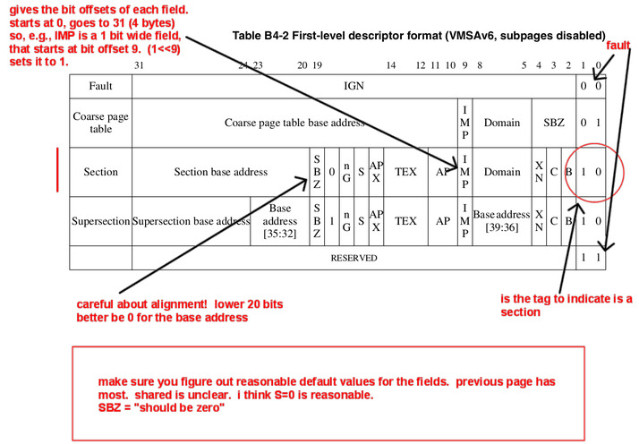
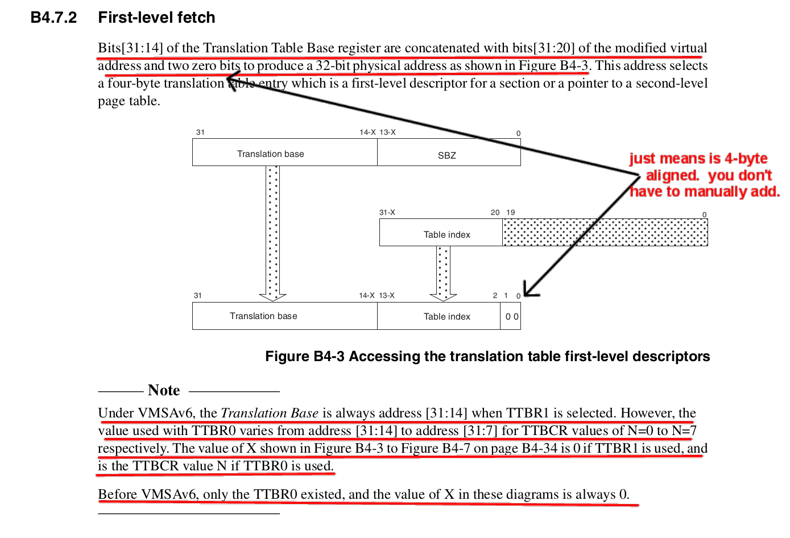
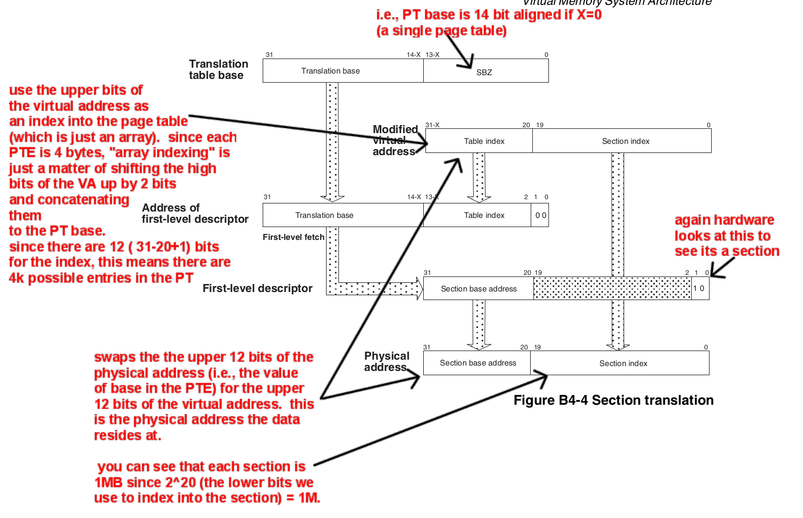

---

marp: true
theme: default
paginate: true
html: true


style: |
section ul,
section ol {
  line-height: 1.2;
  margin-top: 0.1em;
  margin-bottom: 0.1em;
}
section li + li {
    margin-top: 0.1em;
}


---

# Lab 17: page tables (140e:win26)

<!-- Large image across the top -->


---
## Today: page tables

Replace all of our MMU code.
  1. Write: `code/pt-vm.c` 
  2. Combine with: lab 15 hardware MMU code (`your-mmu-asm.S` and `mmu.c`)
  3. Pass the lab 15 tests using page tables instead of pinned.

Result: 
 - Complete working page-table VM system, 
 - None of our MMU code.
 - Also: No more readings!


---
# Recall: 1MB section translation

  <style scoped>
  p, li { font-size: 23px; }
  </style>

  - Section: 1MB-aligned 1MB chunk.  (recall `1024*1024=2^10*2^10=2^20`).
  - Section offset = low 20-bits of 32-bit address.
  - Section number = upper 12-bits of 32-bit address.
```
  // map virtual section to physical section on a store
  uint32_t xlate_store32(uint32_t va) {
    if(va&3)
        throw "alignment exception";
    uint32_t offset = va & ((1u<<20)-1u); // get lo 20 bits
    uint32_t sec    = va >> 20;           // get hi 12 bits
    let e = map[sec];   <----- your page table.
    if(!e)
        throw "section fault"
    if((e->perm & WRITE_PERM) == 0)
        throw "protection fault"
    // physical offset is the same as virtual
    return e->sec << 20 | offset;
  }
```

---
# What you build today: "level 1 page table"

Recall from pinned (lab 13):
  - mapped 1MB virtual page to 1MB physical page
  - mapping was: `va:uint32_t ==> pa:uint32_t`
     - plus: ASID, cache attributes, some other bits
  - easy, but just 8.

Page table:
  - Can be map the entire address space, not just 8 entries.
  - level 1: flat array of 1MB `va -> pa` mappings.  
    - Each mapping ~= TLB entry, except no stored ASID
  - NOTE: you can use smaller 4k, 64k pages but two-level
    - great extension!

---
# How page table used

- On each memory access: TLB still looks for `VA->PA` mapping 
  1. If VA in TLB: works same as before.
  2. If VA not in TLB?  TLB looks in page table.
     - If VA in page table: transparently inserts `VA->PA` mapping in TLB.
     - If not in page table: throws a hardware exception.
     - NOTE: this was happening in pinned-vm: but we used a null PT.

- Two consequences of TLB miss using hardware page table lookup
  1. HW must understand page table: defined by hardware.
  2. HW must find the page table: register points to it (`ttbr0`)
     - Page table address: virtual or physical?
---
# First-level descriptor layout (B4-27 or 6-39)

<!-- Large image across the top -->


---
# How hardware does a lookup

<!-- Large image across the top -->


---
# How hardware does a lookup

<!-- Large image across the top -->


---
# What to do: write `pt-vm.c`

- Each routine in calls a staff version so you can 
  knock off 1-by-1.

- The tests are roughly (same as lab 13,15)
  - Just use PT instead of pinned
  - Can get oriented by looking side by side.

- When done:
  1. Catch a couple exceptions same as lab 13.
  2. Choose-own-adventure: Do some kind of extension.
